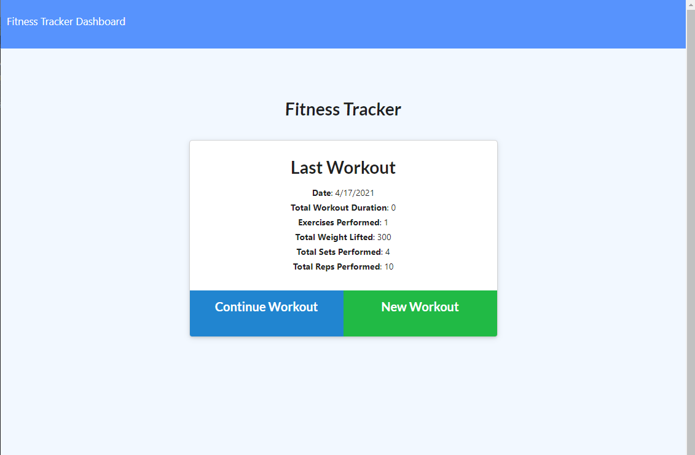
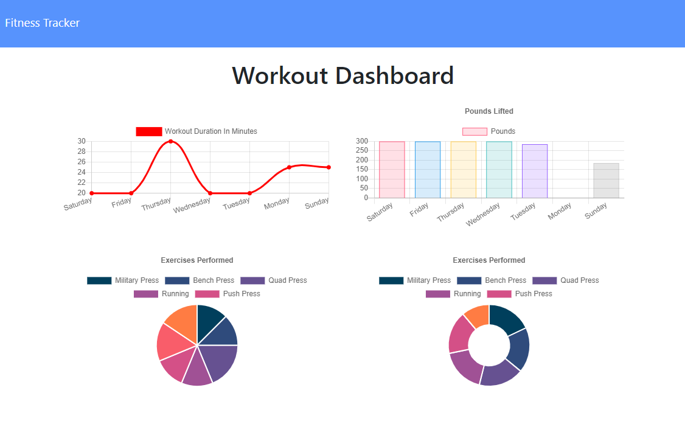

# Fitness Tracker

## Table of Contents

- [License](#license)
- [Links](#links)
- [User Story](#user-story)
- [Technology Used](#technology-used)
- [Screenshots](#screenshots)
- [Questions](#questions)

## Description

This Fitness Tracker is a homework project with the front end coded provided by Trilogy. The idea is to get more comfortable using Mongo databases and have a working Fitness Tracker app.

## License

- 

## Links

- [Github Repository](https://github.com/emacartoon/Fitness-Tracker)
- [Heroku App](https://wiggle-workout-tracker.herokuapp.com/)

## User Story

As a user, I want to be able to view create and track daily workouts. I want to be able to log multiple exercises in a workout on a given day. I should also be able to track the name, type, weight, sets, reps, and duration of exercise. If the exercise is a cardio exercise, I should be able to track my distance traveled.

## Technology Used

JavaScript
Node.js 
Express.js
MongoDB
Mongoose

## Screenshots

Screenshot - First view

Screenshot - Dashboard using MongoDB's data

## Questions

If you have any questions about this project, or happen to use this project, please feel free to reach out to me:
 
Email: emacartoon@gmail.com
 
GitHub: [@EmaCartoon](https://github.com/EmaCartoon)
